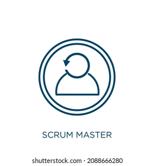
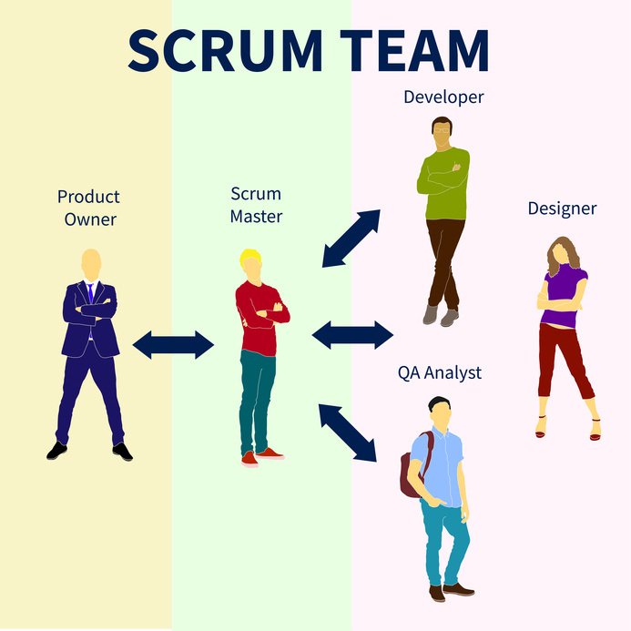

# SCRUM

**PAPÉIS DO SCRUM**

-***Scrum Master***

 -  É o responsável por garantir que a metodologia Scrum seja aplicada corretamente em um projeto de desenvolvimento de software.

-***Product owner***

 
   - É o responsável por representar os interesses dos stakeholders e do cliente no processo de desenvolvimento de um produto.

   

-***Scrum team***

  - É a equipe multidisciplinar que se torna responsável pelo desenvolvimento e entrega do produto.

